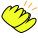
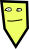
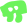
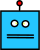

# the complete list of bark's custom syntax
## emojis
**emoji syntax is <a href="https://en.wikipedia.org/wiki/Case_sensitivity">case sensitive</a>.**
|syntax        |result|artist|
|--------------|------|------|
|`:amazed:`    ||<a href="https://github.com/qwertyytheartist">qwertyytheartist</a>|
|`:alien:`     ||<a href="https://github.com/qwertyytheartist">qwertyytheartist</a>|
|`:angry:`     ||<a href="https://github.com/Mariocraft987">Mariocraft987</a>|
|`:blank:`     ||<a href="https://github.com/Mariocraft987">Mariocraft987</a>|
|`:clap:`      ||<a href="https://github.com/qwertyytheartist">qwertyytheartist</a>|
|`:clapAnim:`  ||<a href="https://github.com/qwertyytheartist">qwertyytheartist</a>|
|`:dizzy:`     ||<a href="https://github.com/Mariocraft987">Mariocraft987</a>|
|`:dumo:`      ||<a href="https://github.com/Mariocraft987">Mariocraft987</a>|
|`:evil:`      ||<a href="https://github.com/Mariocraft987">Mariocraft987</a>|
|`:fire:`      ||<a href="https://github.com/qwertyytheartist">qwertyytheartist</a>|
|`:goofy:`     ||<a href="https://github.com/Mariocraft987">Mariocraft987</a>|
|`:happy:`     ||<a href="https://github.com/Mariocraft987">Mariocraft987</a>|
|`:jealous:`   ||<a href="https://github.com/Mariocraft987">Mariocraft987</a>|
|`:joyful:`    ||<a href="https://github.com/Mariocraft987">Mariocraft987</a>|
|`:lol:`       ||<a href="https://github.com/Mariocraft987">Mariocraft987</a>|
|`:mad:`       ||<a href="https://github.com/Mariocraft987">Mariocraft987</a>|
|`:mariocraft:`||<a href="https://github.com/Mariocraft987">Mariocraft987</a>|
|`:mewing:`    ||<a href="https://github.com/nmsderp">nmsderp</a>|
|`:moneyEyes:` ||<a href="https://github.com/Mariocraft987">Mariocraft987</a>|
|`:nerd:`      ||<a href="https://github.com/Mariocraft987">Mariocraft987</a>|
|`:nmsderp:`   ||<a href="https://github.com/Mariocraft987">Mariocraft987</a>|
|`:panic:`     ||<a href="https://github.com/Mariocraft987">Mariocraft987</a>|
|`:pride:`     ||<a href="https://github.com/qwertyytheartist">qwertyytheartist</a>|
|`:qwertyy:`   ||<a href="https://github.com/qwertyytheartist">qwertyytheartist</a>|
|`:robot:`     ||<a href="https://github.com/Mariocraft987">Mariocraft987</a>|
|`:rofl:`      ||<a href="https://github.com/Rubiidev-18">Rubiidev-18</a>|
|`:rubiidev:`  ||<a href="https://github.com/Mariocraft987">Mariocraft987</a>|
|`:sad:`       ||<a href="https://github.com/Mariocraft987">Mariocraft987</a>|
|`:smallSmile:`||<a href="https://github.com/Mariocraft987">Mariocraft987</a>|
|`:smiley:`    ||<a href="https://github.com/Mariocraft987">Mariocraft987</a>|
|`:sussedOut:` ||<a href="https://github.com/Mariocraft987">Mariocraft987</a>|
|`:textHappy:` ||<a href="https://github.com/Mariocraft987">Mariocraft987</a>|
|`:thumb:`     ||<a href="https://github.com/Rubiidev-18">Rubiidev-18</a>|
|`:troll:`     ||<a href="https://github.com/Mariocraft987">Mariocraft987</a>|
|`:woof:`      ||<a href="https://scratch.mit.edu/users/SuperL14M/">SuperL14M</a>|
## collaborator direct links
these are NOT case-sensitive. *please note that these images may be out of date!*
|syntax        |result|creator|
|--------------|------|-------|
|`@mariocraft`||<a href="https://github.com/qwertyytheartist">qwertyytheartist</a>|
|`@qwertyy`||<a href="https://github.com/qwertyytheartist">qwertyytheartist</a>|
|`@rubiidev`||<a href="https://github.com/qwertyytheartist">qwertyytheartist</a>|
|`@nmsderp`||<a href="https://github.com/qwertyytheartist">qwertyytheartist</a>|
|`@thepython555`||<a href="https://github.com/qwertyytheartist">qwertyytheartist</a>|
